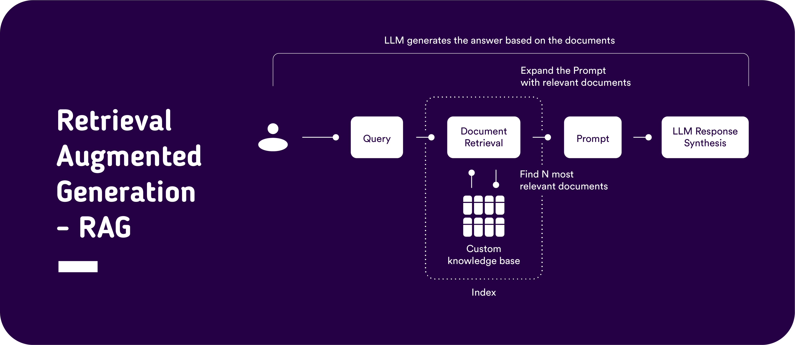
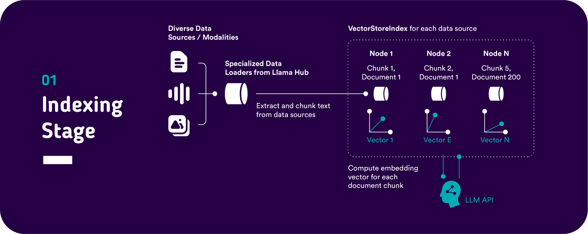
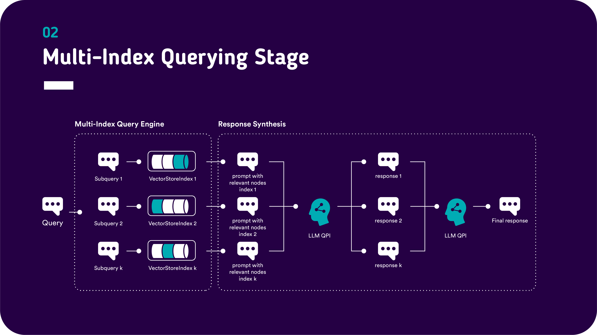

# Introduction 
This repo contains a demo streamlit aplication with which it is possible to perform parallel question answering across multiple pdf Documents.
This functionality is enabled by Llama index and Large Language Models (LLMs).
The code is tested with text-davinci-003 from OpenAI with the configuration in app_config.yaml. Every OpenAI model can be used in the configuration app_config.yaml.

# General
This repo provides some example pdf Documents for indexing which have been generated via ChatGPT 
_**!!! Please note that it is not legally compliant to send personal identifiable information to LLM Apis like OpenAI**_
_**Make sure to test the App only with fictional CV documents, anynomize the CV documents or execute queries against a locally deployed LLM model instead of using OpenAI. PTC takes no legal responsibility for what data you send to OpenAI via this application !!!**_

# Getting Started
1. Download the ESCO dataset version 1.1.0 
[Link to ESCO Download](https://esco.ec.europa.eu/en/use-esco/download)

* Version:  ESCO dataset - v1.1.0
* Content: classification
* Language: en
* File type: csv

1.1. Unzip the .csv file you get send via Email and set the path as an environment variable

2. Setup your environment variables e.g. in an .env file 
> OPENAI_API_KEY = "here comes your openai api key" (example)
> 
> SCO_NER_SEARCHTERMS= "your_path_to_esco_searchterms_skill_ner_csv/ESCO dataset - v1.1.0 - classification - en - csv/searchterms_skill_ner.csv" (example)

3. Install Poetry 
[Link to Poetry CLI installation tutorial](https://python-poetry.org/docs/) 

4. Create Poetry environment and install the package

[Link to Poetry Environment Management](https://realpython.com/dependency-management-python-poetry/)
* In your terminal confirm that poetry is available: 
> poetry --version
* Start a poetry console:
> poetry shell
* Install the package and dependencies via the pyproject.toml:
> poetry install 

If you cannot use Poetry for your dependency management you can alternatively install the requirements via 
> pip install -r requirements.txt 

5. Launch the streamlit app via the poetry shell:
* streamlit run \<your_absolute_path_2_the_app\>\multi_index_demo\app.py

# Overview of the application architecture

